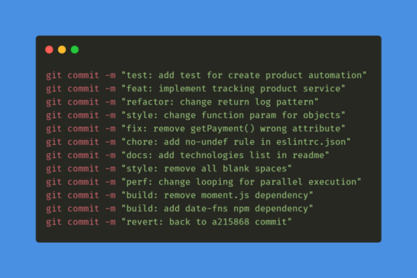

<div align="center">


</div>

<h1 align="center">PI-II-Time2</h1>

<p align="center">
  <strong>Sistema de Acompanhamento de Demandas de Desenvolvimento</strong><br>
  Projeto Integrador II · Engenharia de Software · PUC-Campinas<br>
  <sub>2º Semestre / 2026 · Turma 1</sub>
</p>

<p align="center">
  
  
  
  
  
  
</p>

---

## Sumário

- [Sobre o Projeto](#sobre-o-projeto)
- [Funcionalidades](#funcionalidades)
- [Regras de Negócio](#regras-de-negócio)
- [Tecnologias](#tecnologias)
- [Estrutura do Repositório](#estrutura-do-repositório)
- [Como Executar o Projeto](#como-executar-o-projeto)
- [Equipe](#equipe)
- [Organização do Trabalho](#organização-do-trabalho)
- [Padrão de Commits](#padrão-de-commits)
- [Status do Projeto](#status-do-projeto)

---

## Sobre o Projeto

Este repositório contém o desenvolvimento de um **Sistema de Acompanhamento de Demandas
de Desenvolvimento**, inspirado nas ferramentas usadas por equipes de tecnologia para
organizar tarefas, defeitos (*bugs*), melhorias e documentação de um software.

A aplicação permite que **projetos** cadastrados possuam diversas **demandas** associadas,
cada uma com título, descrição, tipo, prioridade, responsável e status. As demandas podem
ser visualizadas, filtradas, comentadas e atualizadas conforme o perfil de acesso do
usuário, mantendo um **histórico completo de alterações**.

O sistema integra **frontend**, **backend** e **banco de dados relacional** em uma
aplicação funcional, desenvolvida ao longo do componente curricular Projeto Integrador II.

---

## Funcionalidades

### Gestão de Demandas

- Cadastrar, listar, visualizar detalhes e editar demandas
- Atualizar status ao longo do ciclo de vida
- Cancelar demandas — **sem exclusão física** de registros no banco
- Registrar comentários vinculados a demanda, usuário e data/hora
- Consultar o histórico automático de alterações

### Filtros e Buscas

- Filtragem por status, prioridade, tipo, responsável e projeto
- Busca textual por título ou descrição
- Ordenação por prioridade, data de criação, prazo de finalização ou status

### Dashboard

Tela inicial com indicadores resumidos:

| Indicador | Descrição |
|---|---|
| Total de demandas | Contagem geral de demandas cadastradas |
| Demandas por status | Abertas, em andamento, em revisão, concluídas e canceladas |
| Demandas por prioridade | Distribuição entre crítica, alta, média e baixa |
| Demandas por tipo | Distribuição entre tarefa, defeito, melhoria e documentação |
| Demandas críticas em aberto | Itens de prioridade crítica ainda não concluídos |
| Demandas próximas do prazo | Itens com prazo de finalização se aproximando |

### Autenticação e Perfis de Acesso

O sistema possui autenticação com **três perfis**, cada um com permissões distintas:

| Ação | Administrador | Líder de Projeto | Membro da Equipe |
|---|:---:|:---:|:---:|
| Visualizar todos os projetos | ✅ | Apenas vinculados | Apenas vinculados |
| Visualizar todos os usuários | ✅ | ❌ | ❌ |
| Criar demandas | ✅ | ✅ | ❌ |
| Editar demandas | ✅ | Projetos vinculados | ❌ |
| Atribuir / alterar responsável | ✅ | ✅ | ❌ |
| Alterar prioridade | ✅ | ✅ | ❌ |
| Alterar status | Todas as transições | Todas as transições | Transições limitadas |
| Concluir demandas | ✅ | ✅ | ❌ |
| Cancelar demandas | ✅ | ✅ | ❌ |
| Registrar comentários | ✅ | ✅ | ✅ |
| Visualizar histórico | ✅ | ✅ | ✅ |

---

## Regras de Negócio

### Ciclo de Vida da Demanda

```
                  ┌──────────────────────────────┐
                  │                              ▼
   [Aberta] ──▶ [Em andamento] ──▶ [Em revisão] ──▶ [Concluída]
       │              │                  │
       └──────────────┴──────────────────┴──────▶ [Cancelada]
```

- Toda demanda é criada automaticamente com o status **Aberta**
- **Não é permitido** concluir uma demanda diretamente de *Em andamento* — ela deve
  passar por *Em revisão*, simulando uma etapa de conferência, validação ou teste
- **Não é permitido** retornar de *Em andamento* para *Aberta*
- *Em revisão* pode voltar para *Em andamento* quando a conferência reprovar a entrega
- O cancelamento pode ocorrer a qualquer momento, desde que a demanda não esteja concluída
- O **Membro da Equipe** só realiza as transições *Aberta → Em andamento* e
  *Em andamento → Em revisão*

### Classificações

| Categoria | Valores |
|---|---|
| **Tipos** | Tarefa · Defeito · Melhoria · Documentação |
| **Prioridades** | Crítica · Alta · Média · Baixa |
| **Status** | Aberta · Em andamento · Em revisão · Concluída · Cancelada |

### Campos da Demanda

`título` · `descrição` · `tipo` · `prioridade` · `status` · `projeto associado` ·
`responsável` · `data de criação` · `data da última atualização` · `prazo de finalização`

- O campo **responsável** pode ficar em branco na criação, para atribuição posterior
- A **data de criação** é registrada automaticamente no cadastro
- A **data da última atualização** é modificada automaticamente a cada alteração relevante

### Integridade e Auditoria

- O **histórico de alterações** nunca é apagado, mesmo que a demanda seja cancelada
- **Não há exclusão física** de registros: demandas desnecessárias recebem o status
  *Cancelada*, preservando o histórico das atividades

### Validação de Prazo por API Externa

O prazo de finalização é validado contra uma **API externa de feriados nacionais**.
Caso a data informada seja um feriado, o sistema exibe mensagem de erro e impede o
cadastro ou a atualização do prazo.

---

## Tecnologias

| Camada | Tecnologias |
|---|---|
| **Frontend** | HTML5, CSS3, JavaScript, Bootstrap |
| **Backend** | Node.js (LTS), TypeScript, Express |
| **Banco de Dados** | MySQL *(relacional)* |
| **Versionamento** | Git, GitHub, GitHub Projects |
| **IDEs** | Visual Studio Code, JetBrains WebStorm |

---

## Estrutura do Repositório

```
PI-II-Time2/
├── docs/
│   └── reunioes/          # Documento de visão, cronograma e atas de reunião
├── .gitignore
└── README.md
```

> A estrutura de `backend/`, `frontend/` e `database/` será adicionada conforme
> o desenvolvimento avançar.

---

## Como Executar o Projeto

### Pré-requisitos

- [Node.js](https://nodejs.org/) — versão LTS vigente
- [MySQL](https://www.mysql.com/) instalado e em execução
- [Git](https://git-scm.com/)

### Clonando o repositório

```bash
git clone https://github.com/Nathan-Kenzo/PI-II-Time2.git
cd PI-II-Time2
```

> [!NOTE]
> As instruções de instalação de dependências, configuração do banco de dados,
> variáveis de ambiente e execução do backend e do frontend serão documentadas
> nesta seção conforme cada parte do sistema for implementada.

---

## Equipe

| Nome Completo | GitHub |
|---|---|
| Nathan Kenzo Puzipe | [@Nathan-Kenzo](https://github.com/Nathan-Kenzo) |
| Felipe Oliveira Barbosa | `null` |
| Pedro Tiezo Sales Shimizu | [@Tiez0](https://github.com/Tiez0) |
| Henrique Aguiar de Souza Pella | [@henriquepella](https://github.com/henriquepella) |
| Felipe Oliveira dos Santos | [@FelipeOS6](https://github.com/FelipeOS6) |

**Professora Orientadora:** [Renata Arantes](https://github.com/RenataArantes)

---

## Organização do Trabalho

O acompanhamento das atividades é feito pelo **GitHub Projects** deste repositório,
onde são registradas todas as tarefas e as horas dedicadas ao projeto.

### Fluxo de Branches

O desenvolvimento segue o conceito de *feature branches*: cada funcionalidade é
desenvolvida em uma ramificação exclusiva e integrada à `main` somente após estar
funcionando.

```bash
git checkout -b feat/autenticacao   # cria a branch da funcionalidade
# ... desenvolvimento e commits ...
git checkout main
git merge feat/autenticacao         # integra na main
```

### Reuniões de Orientação

Reuniões de acompanhamento às **segundas-feiras, às 07:10h**:

| # | Data | Status |
|:-:|---|---|
| 1 | 17/08 | ✅ Realizada |
| 2 | 31/08 | ⏳ Agendada |
| 3 | 21/09 | ⏳ Agendada |
| 4 | 05/10 | ⏳ Agendada |
| 5 | 26/10 | ⏳ Agendada |
| 6 | 16/11 | ⏳ Agendada |

---

## Padrão de Commits

O projeto utiliza **Conventional Commits** no formato `tipo: descrição`:

| Tipo | Quando usar |
|---|---|
| `feat` | Nova funcionalidade |
| `fix` | Correção de defeito |
| `docs` | Documentação |
| `style` | Formatação, sem mudança de lógica |
| `refactor` | Refatoração sem alterar comportamento |
| `test` | Testes |
| `perf` | Melhoria de performance |
| `build` | Dependências e build |
| `chore` | Configurações e manutenção |
| `revert` | Reversão de um commit anterior |

<div align="center">



</div>

### Autoria dos Artefatos

Todo arquivo do projeto contém, no topo, a **identificação do autor** responsável e
comentários explicativos sobre o código.

```typescript
/**
 * Autor: Nome Completo do Integrante
 * Descrição: responsabilidade deste arquivo
 */
```

---

## Status do Projeto

🟡 **Em desenvolvimento** — ambiente de trabalho configurado.

- [x] Criação do repositório no GitHub
- [x] Inclusão dos integrantes e da professora orientadora
- [x] Configuração inicial do GitHub Projects
- [x] Criação e organização do `README.md`
- [x] Configuração e teste do ambiente Git/GitHub pelos integrantes
- [ ] Modelagem do banco de dados
- [ ] Implementação da API (backend)
- [ ] Implementação da interface (frontend)
- [ ] Integração e testes
- [ ] Release final `1.0.0-final`

---

<p align="center">
  Desenvolvido pelo <strong>Time 2</strong> — Projeto Integrador II · PUC-Campinas · 2026
</p>
